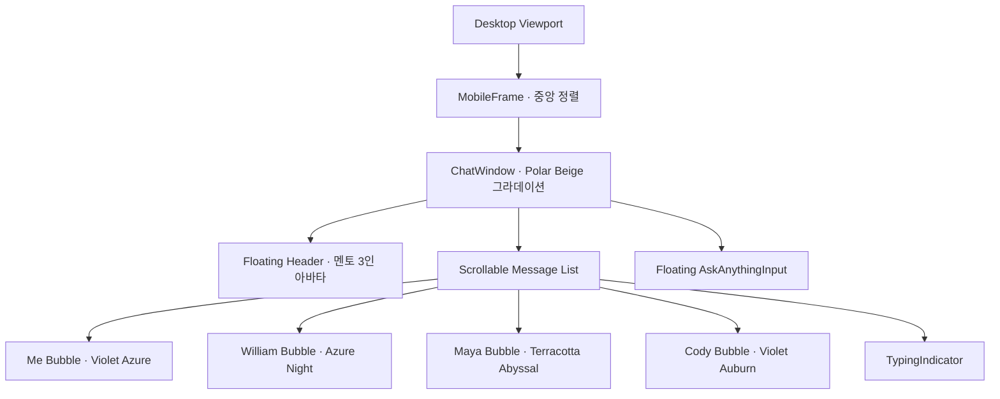
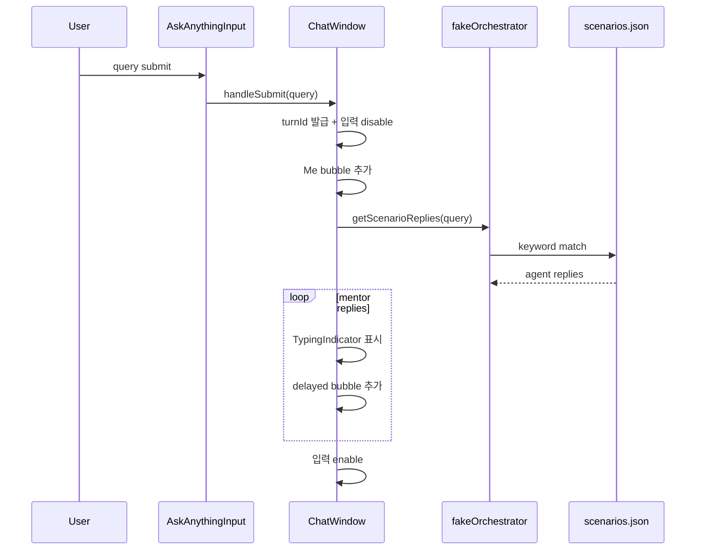

# Phase 1 · Mobile Chat Prototype 계획표

## 목표

Triad AI UX Mentor의 첫 번째 MVP 단계로, 실제 AI API 없이도 William, Maya, Cody 세 명의 UX 멘토가 살아 있는 단톡방처럼 응답하는 mobile-first 채팅 프로토타입을 완성한다.

핵심 목표:

- 모바일 메신저 중심 UI
- 세 멘토의 개별 아바타, 이름, 말투, 버블 색상 구분
- mock 시나리오 기반 fake multi-agent 응답
- typing indicator와 순차 응답으로 believable realtime UX 구현
- Cody 인트로 메시지 자동 표시
- refresh로 대화 초기화 및 진행 중 turn 취소

## 작업 브랜치

- `Project-dev-first-step`

## 화면 구조

## 메시지 흐름

## 구현 체크리스트

| 항목 | 내용 | 결과 |
|---|---|---|
| 프로젝트 초기화 | Next.js 16, TypeScript, Tailwind v4, Framer Motion 구성 | 완료 |
| 레이아웃 | `MobileFrame`, `ChatWindow`, `ChatHeader` 구성 | 완료 |
| 채팅 컴포넌트 | `MessageBubble`, `AgentAvatar`, `TypingIndicator`, `AskAnythingInput` 구현 | 완료 |
| 디자인 토큰 | Woong Design 기반 그라데이션 토큰을 `lib/tokens.ts`와 CSS에 반영 | 완료 |
| 에이전트 메타데이터 | `lib/agents.ts`에 이름, 역할, 아바타, 키워드 정의 | 완료 |
| mock 데이터 | `mock/scenarios.json`, `mock/intro.json` 작성 | 완료 |
| fake orchestrator | 키워드 기반 멘토 라우팅 및 default shuffle 응답 | 완료 |
| turn guard | `activeTurnRef`, `isResponding`, `timeoutsRef`로 중복 응답 방지 | 완료 |
| 인트로 | 앱 로드 후 Cody 인트로 메시지 자동 표시 | 완료 |
| refresh | 진행 중 timeout 취소 및 Cody 인트로 상태로 초기화 | 완료 |
| 검증 | typecheck/build 통과 | 완료 |

## 주요 파일

| 파일 | 역할 |
|---|---|
| `app/layout.tsx` | 앱 전역 레이아웃 |
| `app/page.tsx` | 메인 페이지 진입점 |
| `app/globals.css` | Tailwind 및 전역 스타일 |
| `components/MobileFrame.tsx` | 데스크탑 중앙 모바일 프레임 |
| `components/ChatWindow.tsx` | 메시지 상태, turn guard, 인트로, reset 관리 |
| `components/ChatHeader.tsx` | 상단 floating header |
| `components/MessageBubble.tsx` | 사용자/멘토 버블 렌더링 |
| `components/AgentAvatar.tsx` | 멘토 프로필 이미지 |
| `components/TypingIndicator.tsx` | fake typing animation |
| `components/AskAnythingInput.tsx` | 입력창, send, refresh |
| `lib/agents.ts` | William/Maya/Cody 메타데이터 |
| `lib/tokens.ts` | Woong Design 그라데이션 토큰 |
| `lib/fakeOrchestrator.ts` | mock 시나리오 매칭 및 메시지 ID 생성 |
| `lib/types.ts` | Agent, Message, Scenario 타입 |
| `mock/scenarios.json` | 키워드별 mock 응답 |
| `mock/intro.json` | Cody 인트로 메시지 |
| `public/agents/*.png` | 멘토 아바타 이미지 |

## 완료 기준

| # | 시나리오 | 기대 결과 |
|---|---|---|
| 1 | 페이지 로드 | Cody 인트로 메시지가 자동으로 등장 |
| 2 | 전략 질문 입력 | William 단독 응답 |
| 3 | 스토리텔링 질문 입력 | Maya 단독 응답 |
| 4 | 리서치/AI workflow 질문 입력 | Cody 단독 응답 |
| 5 | 포트폴리오 전반 피드백 질문 입력 | 세 멘토가 순차 응답 |
| 6 | 응답 중 refresh 클릭 | 진행 중 turn 취소 후 Cody 인트로만 남음 |
| 7 | 데스크탑/모바일 뷰포트 확인 | 데스크탑 중앙 프레임, 모바일 풀스크린 유지 |

## Phase 1에서 하지 않은 것

- Gemini API 연동
- 실제 스트리밍 응답
- 실제 뉴스 fetch
- 포트폴리오 업로드
- 메모리 저장
- LangGraph, vector DB, websocket, real multi-agent infrastructure
