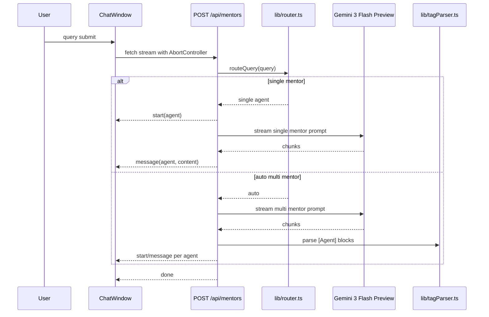

# Phase 2 · Gemini 3 Flash Preview 연동 계획

## 목표

Phase 1의 모바일 채팅 UX와 fake realtime 감각은 유지하되, mock 답변을 Gemini 3 Flash Preview 기반 실제 멘토 응답으로 교체한다.

핵심 방식:

- 하이브리드 라우팅: 단독 키워드 매칭은 해당 멘토 1인 호출, 복합/매칭 실패는 Gemini가 `[William]`, `[Maya]`, `[Cody]` 태그로 응답 멘토를 결정
- 메시지 단위 스트리밍: 백엔드가 Gemini stream을 받는 동안 클라이언트는 typing indicator를 보여주고, 멘토별 완성 메시지를 순차 버블로 추가
- 안전한 fallback: API 키가 없거나 호출 실패 시 Phase 1 mock 응답으로 자연스럽게 복귀

## 왜 Gemini 3 Flash Preview인가

Phase 2의 핵심은 "가장 똑똑한 모델"을 붙이는 것이 아니라, 세 명의 UX 멘토가 살아 있는 것처럼 느껴지는 대화 harness를 적절한 비용과 빠른 응답으로 검증하는 것이다. 초기 구현은 `gemini-2.5-flash`였지만, 멘토 답변 품질과 persona 유지력을 높이기 위해 기본 모델을 `gemini-3-flash-preview`로 변경한다.

선택 이유:

- **품질/비용 균형 개선**: `gemini-2.5-flash`보다 비용은 약 20% 증가하지만, Gemini 3 Flash 계열이라 멘토 말투, 구조화된 피드백, 태그 출력 안정성 개선을 기대할 수 있다.
- **Pro 대비 낮은 비용**: `gemini-3.1-pro`보다 훨씬 저렴하면서도 MVP 채팅 turn에는 충분한 품질을 제공한다.
- **낮은 지연 시간**: 채팅 UX에서는 응답 품질만큼 "기다리는 느낌"이 중요하다. Flash 계열은 Pro보다 빠른 응답을 기대할 수 있어 typing indicator와 잘 맞는다.
- **1M context window**: 당장은 짧은 최근 대화만 쓰지만, 이후 Phase 4-6에서 포트폴리오 요약, 최근 대화, memory summary를 붙일 여지가 있다.
- **thinking budget 제어**: `thinkingBudget: 0`으로 비용과 지연을 줄일 수 있다. Phase 2는 깊은 장문 reasoning보다 짧고 자연스러운 멘토 코멘트가 우선이다.
- **현재 모델 수명**: 더 싼 `gemini-2.0-flash`는 공식 문서상 deprecated이며 2026-06-01 종료 예정이라 새 기능의 기본 모델로 적합하지 않다.

> 모델 정정 메모: 현재 구현은 `gemini-2.0-flash`가 아니라 `gemini-2.5-flash`에서 시작했다. 사용자가 언급한 `gemini-2.0-pro`는 공식 Gemini API 모델로 확인되지 않는다. "Gemini 3 Flash"는 실제 API 모델 코드 기준 `gemini-3-flash-preview`로 적용한다. 별도로 `gemini-3.5-flash`도 호출 가능하지만, 이번 변경 범위는 사용자가 요청한 Gemini 3 Flash 계열에 맞춘다.

## 모델별 토큰 비용 비교

기준: Google Gemini API 공식 pricing, Paid Tier, text 기준, 2026-05-25 확인. 단가는 USD / 1M tokens. 출력 가격은 thinking token 포함 모델의 경우 이를 포함한다.

| 모델 | 입력 단가 | 출력 단가 | Phase 2 적합성 |
|---|---:|---:|---|
| `gemini-2.5-flash-lite` | $0.10 | $0.40 | 가장 저렴하지만 멘토 persona 유지, nuanced critique, 태그 구조 안정성은 Flash보다 약할 수 있음 |
| `gemini-3.1-flash-lite` | $0.25 | $1.50 | 2.5 Flash보다 저렴한 최신 Lite 후보. 품질 검증 필요 |
| `gemini-2.5-flash` | $0.30 | $2.50 | 초기 구현 모델. 비용/속도 균형은 좋지만 답변 품질 개선 여지가 있음 |
| `gemini-3-flash-preview` | $0.45 | $2.70 | 현재 선택. 2.5 Flash 대비 약간 비싸지만 Gemini 3 Flash 품질 기대 |
| `gemini-2.5-pro` | $1.25 (<=200K prompt) | $10.00 (<=200K prompt) | 복잡한 reasoning에는 좋지만 MVP 채팅 turn에는 비용 과함 |
| `gemini-3.1-pro` | $2.00 (<=200K prompt) | $12.00 (<=200K prompt) | 품질 우선 후보. 비용은 가장 큼 |
| `gemini-2.0-flash` | $0.10 | $0.40 | 비용은 낮지만 deprecated, 2026-06-01 종료 예정이라 제외 |

샘플 계산: Phase 2의 일반 turn을 **입력 2,000 tokens + 출력 600 tokens**로 가정.

| 모델 | 예상 비용 / turn | 2.5 Flash 대비 |
|---|---:|---:|
| `gemini-2.5-flash-lite` | 약 $0.00044 | 약 21% |
| `gemini-3.1-flash-lite` | 약 $0.00140 | 약 67% |
| `gemini-2.5-flash` | 약 $0.00210 | 100% |
| `gemini-3-flash-preview` | 약 $0.00252 | 약 120% |
| `gemini-2.5-pro` | 약 $0.00850 | 약 405% |
| `gemini-3.1-pro` | 약 $0.01120 | 약 533% |
| `gemini-2.0-flash` | 약 $0.00044 | 약 21%, 단 deprecated |

결론: Flash-Lite는 비용만 보면 매력적이지만, Phase 2의 핵심 리스크는 "비용 최소화"보다 "세 멘토의 말투와 응답 구조가 믿을 만하게 유지되는가"다. `gemini-3-flash-preview`는 `gemini-2.5-flash` 대비 비용이 약 20% 늘지만, Pro 계열 대비 여전히 저렴하고 Gemini 3 Flash 품질을 기대할 수 있어 현재 MVP의 기본값으로 적합하다. 응답 품질을 더 강하게 끌어올려야 하면 `gemini-3.1-pro` 또는 `gemini-3.5-flash`를 후속 후보로 둔다.

## 권장 교체 옵션

| 옵션 | 모델 | 장점 | 리스크 |
|---|---|---|---|
| 비용 최소화 | `gemini-3.1-flash-lite` | 2.5 Flash보다 저렴하고 최신 Lite 계열 | 멘토 persona/태그 출력 안정성 검증 필요 |
| 균형안 | `gemini-3-flash-preview` | 현재 선택. 비용 증가가 작고 품질 개선 기대 | Preview 모델이라 추후 stable 모델로 교체 가능성 있음 |
| 품질 우선 | `gemini-3.1-pro` | 가장 안정적인 reasoning과 피드백 품질 기대 | turn당 비용이 2.5 Flash 대비 약 5.3배 |

## 작업 브랜치

- `Project-dev-second-step`

## 데이터 흐름

## 구현 체크리스트

1. `@google/genai` 설치 및 `.env.example` 추가
2. `lib/prompts.ts`에 William/Maya/Cody 압축 constitution 작성
3. `lib/router.ts`에 하이브리드 라우팅 구현
4. `lib/tagParser.ts`에 `[William]`, `[Maya]`, `[Cody]` 태그 split 구현
5. `lib/gemini.ts`에 `gemini-3-flash-preview` streaming 유틸 작성
6. `app/api/mentors/route.ts`에 SSE route handler 구현
7. `lib/chatClient.ts`에 fetch stream/SSE parser 구현
8. `components/ChatWindow.tsx`를 Gemini stream 기반으로 연결
9. refresh abort, 최소 typing 표시 시간, mock fallback 보강
10. `Mainplan.md` Phase 2 상태 및 구현 설명 갱신
11. `npm run typecheck`, `npm run build`로 검증

## Phase 2에서 하지 않는 것

- 토큰 단위 type-on 애니메이션
- Cody 실제 뉴스 fetch
- 포트폴리오 업로드/분석
- 메모리 영속화
- LangGraph, vector DB, websocket, real multi-agent infrastructure
