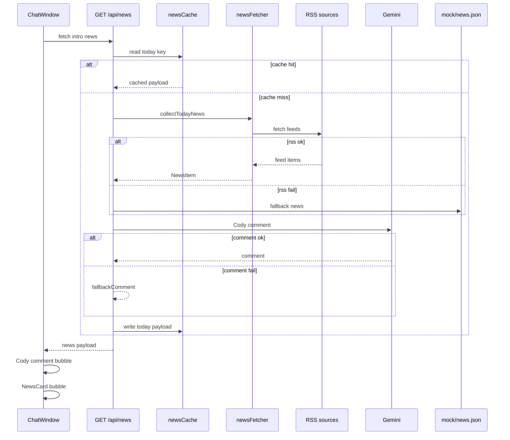

# Phase 3 · Cody Daily News Feed 계획표

## 목표

앱 로드 시 Cody가 실제 RSS에서 가져온 오늘의 UX/AI 뉴스 1건을 NewsCard로 공유한다. 같은 날에는 첫 결과를 서버 메모리에 캐싱해 새로고침이나 refresh를 해도 같은 뉴스와 코멘트를 재사용하고, RSS 또는 Gemini 호출이 실패하면 mock 뉴스로 자연스럽게 fallback한다.

핵심 목표:

- RSS 기반 실제 UX/AI 뉴스 수집
- 하루 1회 고정 뉴스 캐시
- Cody의 짧은 Gemini 코멘트
- 실패 시 `mock/news.json` fallback
- 전용 `NewsCard` 컴포넌트
- Phase 2 채팅/Gemini 응답 흐름 유지

## 작업 브랜치

- `Project-dev-third-step`

## 데이터 흐름

## 구현 체크리스트

| 항목 | 내용 |
|---|---|
| 의존성 | `rss-parser` 설치 |
| 타입 | `NewsItem`, `NewsApiResponse`, `news` 메시지 variant 추가 |
| fallback 데이터 | `mock/news.json` 작성 |
| RSS 수집 | `lib/newsFetcher.ts`에서 멀티 소스 RSS 수집, timeout, 정규화 |
| 일자 캐시 | `lib/newsCache.ts`에서 같은 날 동일 payload 반환 |
| Cody 프롬프트 | `lib/newsPrompts.ts`에서 뉴스 코멘트용 짧은 프롬프트 작성 |
| API | `app/api/news/route.ts`에서 cache → RSS → Gemini → mock fallback 순서 구현 |
| 카드 UI | `components/NewsCard.tsx` 구현 |
| 채팅 통합 | `components/ChatWindow.tsx`의 인트로를 Cody 코멘트 + NewsCard로 교체 |
| 문서 | `Mainplan.md`, `README.md`에 Phase 3 내용 반영 |
| 검증 | `npm run typecheck`, `npm run build` 통과 |

## RSS 소스 후보

- UX Collective: `https://uxdesign.cc/feed`
- Smashing Magazine: `https://www.smashingmagazine.com/feed/`
- Nielsen Norman Group: `https://www.nngroup.com/feed/rss/`
- Google Research Blog: `https://research.google/blog/rss/`

## 완료 기준

| # | 시나리오 | 기대 결과 |
|---|---|---|
| 1 | 앱 로드 | Cody typing 후 코멘트 메시지와 NewsCard 등장 |
| 2 | 같은 날 refresh | 같은 뉴스와 코멘트 재사용 |
| 3 | RSS 실패 | `mock/news.json` fallback 뉴스 표시 |
| 4 | Gemini 키 없음 | RSS 뉴스는 표시하고 fallback 코멘트 사용 |
| 5 | 카드 링크 클릭 | 원문 URL이 새 탭으로 열림 |
| 6 | 일반 채팅 입력 | Phase 2 Gemini 멘토 응답 흐름 유지 |

## Phase 3에서 하지 않는 것

- 풀텍스트 페이지 스크래핑
- 뉴스 개인화/추천
- 뉴스 카테고리 필터 UI
- 포트폴리오 업로드/분석
- 메모리 영속화
- LangGraph, vector DB, websocket, real multi-agent infrastructure
