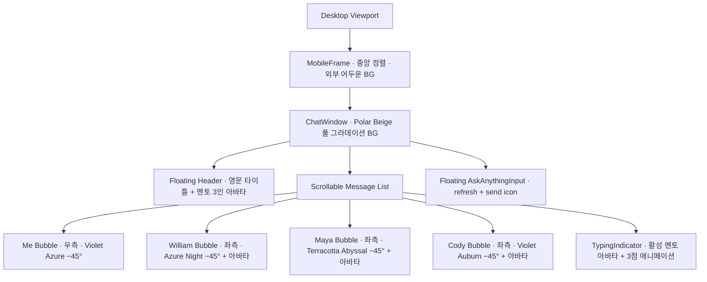
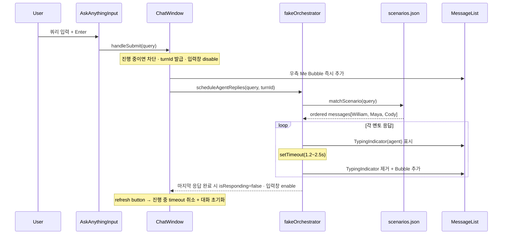
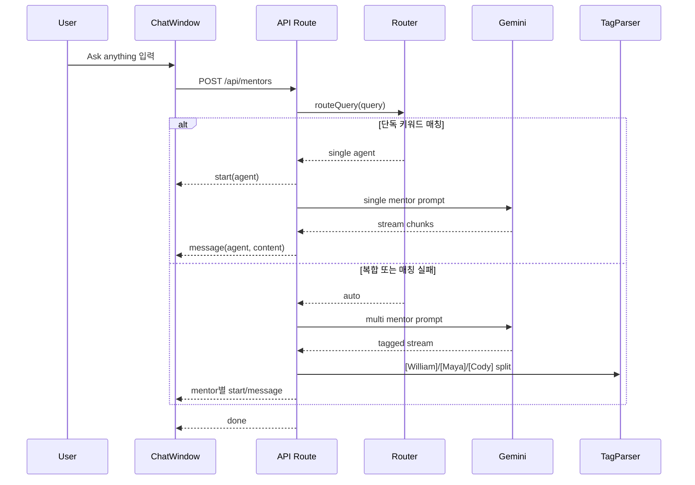
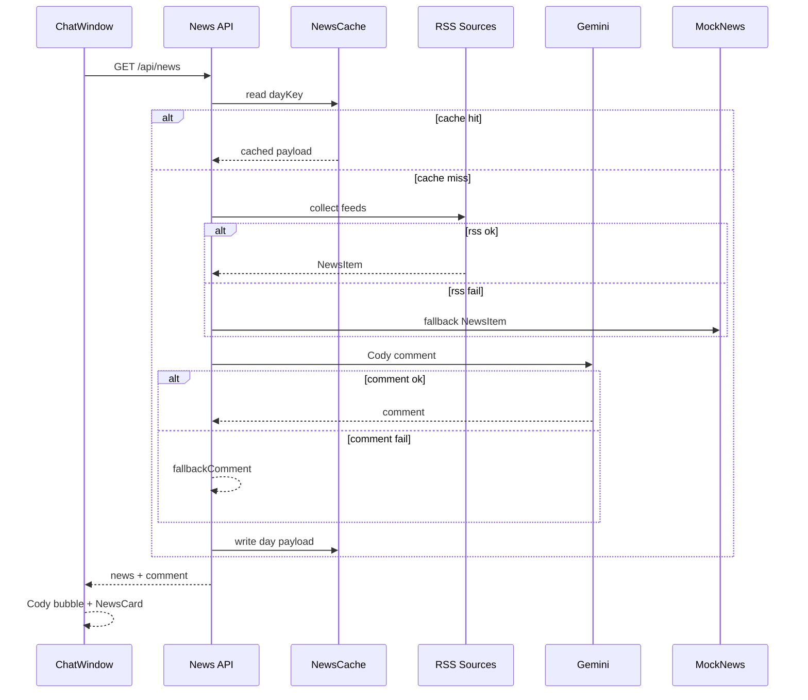

# AI UX 멘토 팀 MVP

> 실시간 AI UX 멘토 단톡방처럼 느껴지는 lightweight MVP 웹 애플리케이션 프로젝트. 일반적인 챗봇이 아니다.

## Overview

이 프로젝트의 핵심 목표는 다음과 같다:

- <span style="color:#B85C4F">**살아있는 UX 멘토 팀**</span> — 실제 그룹 채팅처럼 느껴지는 경험
- <span style="color:#B85C4F">**실제 그룹 채팅 경험**</span> — collaborative AI mentor interaction
- <span style="color:#4065F8">**mobile-first messenger UX**</span> — 메신저 중심의 몰입형 인터페이스

---

## 핵심 철학

이 프로젝트는 **Prompt Engineering** 보다 **Harness Engineering** 중심으로 설계한다.

즉, 복잡한 AI 구조보다 다음을 우선한다:

- <span style="color:#B85C4F">**believable interaction**</span> — 믿을 수 있는 상호작용
- <span style="color:#B85C4F">**emotional UX**</span> — 감정적 UX
- <span style="color:#B85C4F">**immersive mentor experience**</span> — 몰입형 멘토 경험

**Key Characteristics**
- 기술적 완벽함보다 *실제 UX 멘토 팀과 대화하는 느낌*을 최우선
- 감정적인 UX와 believable mentor interaction을 기술 복잡도보다 앞세운다
- Cursor-first vibecoding으로 빠른 반복을 목표로 한다

---

## MVP 핵심 전략

초기 단계에서는 다음을 목표로 한다:

| 목표 | 설명 |
|---|---|
| **low complexity** | 단순한 아키텍처, 빠른 구현 |
| **low API cost** | Gemini Flash, 최대 5페이지 분석 등 비용 절감 |
| **fast iteration** | Phase 단위 점진적 개발 |
| **Cursor-first vibecoding** | AI 코딩 도구 중심 개발 흐름 |

---

## MVP 규칙 · 구현하지 않는 것

<span style="color:#FF105C">**MVP 단계에서 구현하지 않는다:**</span>

- real multi-agent infrastructure
- LangGraph
- vector database
- distributed agents
- websocket infrastructure
- advanced orchestration
- real-time synchronization

<span style="color:#4065F8">**대신 아래 구조를 사용한다:**</span>

- **fake multi-agent orchestration** — 단일 API 호출 + 역할별 포맷팅
- **single Gemini API call** — 1회 호출로 3명 응답 생성
- **role-based response formatting** — `[William]`, `[Maya]`, `[Cody]` 태그 분리
- **fake typing animations** — 타이핑·지연으로 생동감 연출
- **lightweight architecture** — 최소 의존성, 빠른 배포

---

## 핵심 컨셉 · 3명의 AI UX 멘토

### 1. William — <span style="color:#4065F8">전략 중심 UX 멘토</span>

**전문 영역**
- systems thinking · business impact · product thinking
- UX strategy · information architecture · portfolio strategy

**특징**
- 논리적 · 구조적 · 전략 중심
- *principal designer* 느낌

### 2. Maya — <span style="color:#B85C4F">감정 중심 UX 멘토</span>

**전문 영역**
- storytelling · emotional UX · communication clarity
- presentation flow · human-centered thinking

**특징**
- 따뜻함 · 공감 중심 · narrative 기반
- *UX lead* 느낌

### 3. Cody — <span style="color:#9747FF">UX Research + AI Workflow 멘토</span>

**전문 영역**
- UX research · design research · usability analysis
- AI workflow · implementation systems · automation · operational UX

**특징**
- 실무형 · 시스템 중심 · 리서치 기반
- *AI workflow engineer* 느낌

---

## 핵심 UX 방향

사용자는 **William**, **Maya**, **Cody**와 그룹 채팅 형태로 동시에 대화한다.

UX는 다음처럼 느껴져야 한다:

- <span style="color:#B85C4F">**살아있는 단톡방**</span>
- <span style="color:#B85C4F">**실제 멘토 그룹**</span>
- <span style="color:#4065F8">**AI 메신저**</span>

---

## 핵심 UI 방향

웹사이트 전체는 <span style="color:#4065F8">**MOBILE CHAT UI**</span> 중심으로 구성한다.

**Desktop browser 기준**
- 어두운 배경
- 중앙 mobile phone frame
- mobile-first UX
- immersive messenger 느낌

**참고 UX:** iMessage · Discord · modern AI messenger

### 주요 UI 요소 · 반드시 포함

- smooth animations
- rounded message bubbles
- typing indicators
- agent avatars
- smooth scrolling
- subtle transitions
- bottom `Ask anything` input · 물리 키보드 호환

### 그라데이션 토큰 매핑 · Woong Design 기반

모든 그라데이션은 <span style="color:#4065F8">**−45° 방향**</span>으로 통일 ([Woongdesign.md](Woongdesign.md) 규칙 유지).

| 대상 | 토큰 | From → To | 텍스트 |
|---|---|---|---|
| **MobileFrame BG** | `{gradient.mixed.soft.polar-beige}` | Polar Dew `#A1D0F6` → Soft Beige `#EEDCD6` | — |
| **Me Bubble** (우측) | `{gradient.cool.violet-azure}` | Mystic Violet `#9747FF` → Kinetic Azure `#4065F8` | <span style="color:#FCFCFF">**Canvas #FCFCFF**</span> |
| **William Bubble** (좌측) | `{gradient.cool.azure-night}` | Kinetic Azure `#4065F8` → Phantom Night `#001C33` | <span style="color:#FCFCFF">**Canvas #FCFCFF**</span> |
| **Maya Bubble** (좌측) | `{gradient.warm.terracotta-abyssal}` | Terracotta Red `#B85C4F` → Abyssal Red `#771B0E` | <span style="color:#FCFCFF">**Canvas #FCFCFF**</span> |
| **Cody Bubble** (좌측) | `{gradient.mixed.strong.violet-auburn}` | Mystic Violet `#9747FF` → Auburn Flare `#8C3124` | <span style="color:#FCFCFF">**Canvas #FCFCFF**</span> |

> 시인성을 위해 Phase 1 구현 중 초기 매핑(`ice-azure` / `rose-terracotta` / `polar-rose`)을 위 strong 계열로 변경했다. 인라인 `style={{ background }}`로 직접 주입한다.

**Border radius** — 버블 `{rounded.lg}` 16px · MobileFrame `{rounded.frame}` 24px · 아바타 `{rounded.full}` 50%

**Typography** — Pretendard 본문 (디스플레이는 프로토타입 단계 사용 안 함)

### 디자인 시스템 예외 메모

<span style="color:#FF105C">**의도된 예외:**</span> [Woongdesign.md](Woongdesign.md)는 그라데이션을 *풀블리드 배경 / 큰 헤더 배너* 전용으로 제한하고, Cool/Warm 톤을 한 페이지에 섞지 않는다고 규정한다. 본 프로토타입은 <span style="color:#9747FF">**에이전트 식별을 색으로 즉시 인지시키는 목적**</span>에 한해 이 두 규칙의 예외를 적용한다. 카드·버튼 등 다른 컴포넌트에는 이 예외를 확장하지 않는다.

---

## 핵심 경험

앱을 열면 **Cody**가 먼저 등장해서 AI 뉴스 또는 디자인 뉴스를 그룹 채팅에 공유한다 (Phase 1에서는 `/mock/intro.json` 재생, Phase 3에서 daily news로 확장).

**예시**

```
Cody:
오늘은 AI agent UX 관련해서 흥미로운 흐름이 보여요.
```

그 이후 사용자가 하단 `Ask anything`에 쿼리를 던지면, 키워드에 맞는 멘토가 활성화되어 **William** · **Maya** · **Cody**가 각자의 톤으로 응답한다.

핵심은 <span style="color:#B85C4F">**"살아있는 UX 멘토 그룹"**</span>처럼 느껴지는 것이다.

---

## 시스템 구조

초기 MVP는 실제 multi-agent architecture를 구현하지 않는다.

<span style="color:#4065F8">**Single Gemini Call + Fake Multi-Agent Formatting**</span> 방식을 사용한다.

### Fake Multi-Agent 방식

Gemini API는 **1번만** 호출한다.

**응답 예시**

```
[William]
전략적으로는...

[Maya]
사용자 경험 측면에서는...

[Cody]
리서치 관점에서는...
```

프론트엔드는 응답 split · 개별 message rendering · fake typing animation을 처리한다.

---

## Tech Stack

| 영역 | 기술 |
|---|---|
| 프레임워크 | Next.js App Router |
| 언어 | TypeScript |
| 스타일 | TailwindCSS |
| 애니메이션 | Framer Motion |
| AI | <span style="color:#9747FF">**Gemini 2.5 Flash API**</span> |
| 뉴스 | RSS feed + same-day server cache |
| 배포 | Vercel |

---

## 프로젝트 폴더 구조

```
/app
  layout.tsx · page.tsx · globals.css
  /api
    mentors/route.ts ← Phase 2 Gemini mentor SSE
    news/route.ts    ← Phase 3 Cody daily news
/components
  MobileFrame.tsx
  ChatWindow.tsx
  ChatHeader.tsx
  MessageBubble.tsx
  AgentAvatar.tsx
  TypingIndicator.tsx
  AskAnythingInput.tsx
  NewsCard.tsx        ← Phase 3
  UploadModal.tsx     ← Phase 4
/lib
  agents.ts           ← 에이전트 메타데이터 (이름, 그라데이션, 아바타 경로, 키워드)
  tokens.ts           ← 그라데이션 토큰 상수 (Woong Design 미러)
  router.ts           ← Phase 2 하이브리드 멘토 라우팅
  gemini.ts           ← Gemini streaming utility
  newsFetcher.ts      ← Phase 3 RSS 수집 + 정규화
  newsCache.ts        ← Phase 3 same-day server cache
  newsPrompts.ts      ← Cody 뉴스 코멘트 프롬프트
  fakeOrchestrator.ts ← mock fallback 응답
  types.ts            ← Message · Agent · Variant 타입
/agents
  william.md · maya.md · cody.md  ← Agent Constitution (compressed)
/mock
  scenarios.json      ← 쿼리 키워드 → 멘토별 응답 매핑
  intro.json          ← 앱 로드 시 Cody 인트로 메시지
  news.json           ← Phase 3 daily news
/memory
  memory.json         ← Phase 6 local memory
/public/agents
  William.png · Maya.png · Cody.png  ← Agent profile images에서 복사
```

### 컴포넌트 역할 요약

| 컴포넌트 | 역할 |
|---|---|
| **`MobileFrame`** | 데스크탑에서 중앙 정렬 · 어두운 외부 BG · 모바일은 풀스크린 |
| **`ChatWindow`** | Polar Beige 그라데이션 BG · 스크롤 메시지 리스트 컨테이너 |
| **`ChatHeader`** | 상단 고정 · 멘토 3인 아바타 + 이름 + 상태 |
| **`MessageBubble`** | `variant: 'user' \| 'william' \| 'maya' \| 'cody'` 별 그라데이션·정렬·아바타 표시 |
| **`NewsCard`** | Phase 3 Cody daily news 카드 · 카테고리/소스/제목/요약/링크 표시 |
| **`AgentAvatar`** | 40px 원형 · `/public/agents/*.png` 로드 |
| **`TypingIndicator`** | 좌측 정렬 · 해당 멘토 아바타 + 3점 애니메이션 |
| **`AskAnythingInput`** | 하단 sticky · Canvas BG + 1px hairline · Enter submit · Shift+Enter 줄바꿈 |

---

## Agent Constitution 구조

`/agents/william.md` · `/agents/maya.md` · `/agents/cody.md` 각 파일은 다음을 markdown 형태로 정의한다:

- **personality** — 성격
- **tone** — 어조
- **role** — 역할
- **constraints** — 제약
- **output style** — 응답 스타일

> 상세 정의는 [Agent md/William.md](Agent%20md/William.md) · [Agent md/Maya.md](Agent%20md/Maya.md) · [Agent md/Cody.md](Agent%20md/Cody.md) 참고.

<span style="color:#FF105C">**IMPORTANT:**</span> 초기 MVP에서는 full constitution 대신 **compressed summary constitution**을 사용한다 (Phase 2에서 Gemini 프롬프트의 system 영역에 주입).

---

## Fake Orchestrator 구조

초기 orchestrator는 매우 단순하게 구현한다.

| 질문 유형 | 활성화 에이전트 |
|---|---|
| 전략 질문 | William |
| storytelling 질문 | Maya |
| UX research 질문 | Cody |
| 복합 질문 | 3명 모두 |

<span style="color:#FF105C">**IMPORTANT:**</span> 항상 3명 모두 응답하지 않는다. **필요한 에이전트만** 활성화한다.

---

## Cody Daily News Feed

앱 로드 시 Cody가 proactive하게 뉴스 하나를 공유한다.

- Phase 3에서는 **RSS feed 기반 실제 뉴스**를 사용한다.
- 같은 날에는 서버 메모리에 캐시한 첫 결과를 재사용해 refresh해도 같은 뉴스/코멘트를 보여준다.
- RSS 수집 또는 Gemini 코멘트 생성 실패 시 `/mock/news.json`으로 fallback한다.
- <span style="color:#FF105C">풀텍스트 스크래핑·크롤링 구현 금지</span> — RSS가 제공하는 제목/요약/링크만 사용한다.

**예시 구조:** `/mock/news.json`

**초기 목표:** believable researcher 느낌 · UX trend briefing 느낌

---

## Portfolio Upload MVP

사용자는 PDF portfolio · image portfolio를 업로드할 수 있어야 한다.

### Portfolio 분석 흐름

1. PDF 업로드
2. page preview 생성
3. **최대 5페이지** 선택
4. 선택한 페이지 분석
5. AI mentor feedback 출력

<span style="color:#FF105C">**IMPORTANT:**</span> API 비용 절감을 위해 **최대 5페이지까지만** 분석한다.

### 분석 UX

분석 중 fake realtime UX를 적극 사용한다.

**예시:** `"Cody is analyzing UX research quality..."`

이후 순서대로 출력:
- **William** → 전략 피드백
- **Maya** → storytelling 피드백
- **Cody** → research/process 피드백

### Portfolio 분석 비용 최적화 · 반드시 적용

- Gemini Flash만 사용
- max 5 pages
- image compression · image resize
- 최근 대화만 유지
- <span style="color:#FF105C">긴 context 금지</span>

### 이미지 처리 전략

PDF 업로드 시: PDF → image 변환 → resize → compressed jpeg 생성

**권장:** max width 1400px · jpeg quality 0.6~0.7

---

## Memory 전략

초기 MVP에서는 <span style="color:#FF105C">vector DB 사용 금지</span>.

대신 **local JSON memory** 사용. 예시: `/memory/memory.json`

### Memory 구조 예시

```json
{
  "career_goal": "",
  "preferred_style": "",
  "recent_topics": [],
  "agent_notes": {
    "william": [],
    "maya": [],
    "cody": []
  }
}
```

---

## Fake Realtime UX

초기 MVP에서는 <span style="color:#FF105C">실제 realtime 구현 금지</span>.

대신 fake realtime UX 사용:
- typing indicator
- delayed responses
- staged rendering

핵심은 <span style="color:#B85C4F">**"실제로 살아있는 팀처럼 느껴지는 UX"**</span>이다.

---

## 추천 개발 순서

| Phase | 범위 | 상태 |
|---|---|---|
| <span style="color:#4065F8">**Phase 1**</span> | mobile chat UI · fake 시나리오 응답 · 타이핑 애니메이션 · 인트로 시퀀스 | 완료 |
| <span style="color:#9747FF">**Phase 2**</span> | Gemini 2.5 Flash 연동 · `[William]/[Maya]/[Cody]` 태그 split · 응답 스트리밍 | 완료 |
| <span style="color:#9747FF">**Phase 3**</span> | Cody RSS daily news feed · NewsCard · same-day cache · mock fallback | <span style="color:#9747FF">**이번 단계**</span> |
| **Phase 4** | portfolio upload · page preview · 최대 5페이지 선택 | — |
| **Phase 5** | portfolio AI analysis (William → Maya → Cody 순) | — |
| **Phase 6** | memory persistence · chat history optimization | — |

---

## Phase 1 프로토타입 상세

<span style="color:#4065F8">**이번 단계 목표**</span> — 3명의 멘토가 살아 있는 듯이 대화하는 *모바일 채팅 UI 프로토타입*을 완성한다. API 호출 없이 mock 시나리오로 모든 흐름을 재현한다.

### 화면 구조 도식

`ChatWindow`는 풀 그라데이션 캔버스이고, 헤더와 입력창은 그 위에 떠 있는 **floating layer**다. 초기 플랜의 sticky 구조는 floating으로 변경되었다.



### 메시지 흐름 · fake orchestrator

한 질문 = 한 turn 단위 응답 시퀀스를 보장하기 위해 `ChatWindow`에 `activeTurnRef`와 `isResponding` 가드를 두었다. 진행 중 submit은 차단되고, refresh로 turn을 강제 종료할 수 있다.



### Harness Engineering 구현 디테일

- **`fakeOrchestrator`** — 쿼리 키워드 기반 라우팅, Fake Orchestrator 규칙을 그대로 따름:
  - 전략 키워드 → <span style="color:#4065F8">**William 단독**</span>
  - 스토리텔링 / 감정 키워드 → <span style="color:#B85C4F">**Maya 단독**</span>
  - 리서치 / AI workflow 키워드 → <span style="color:#9747FF">**Cody 단독**</span>
  - 그 외 / 복합 → 3명 모두 (랜덤 순서 + 1.2~2.5s 간격)
- **`ChatWindow`** — turn 단위 가드 (`activeTurnRef`, `isResponding`) 로 중복 응답 차단. `timeoutsRef`로 진행 중 setTimeout을 추적하고 refresh 시 일괄 cancel.
- **`MessageBubble`** — variant별 그라데이션을 인라인 `style={{ background }}`로 직접 주입해 Tailwind/HMR 누락 위험 제거.
- **`AskAnythingInput`** — Enter submit / Shift+Enter 줄바꿈. 좌측 refresh icon으로 대화 초기화, 우측 send icon으로 제출. 응답 중에는 disable.
- **`TypingIndicator`** — 좌측 정렬 · 해당 멘토 아바타 + 3점 애니메이션 (Framer Motion). 점에 멘토 그라데이션을 그대로 적용.
- **Floating layer** — `ChatWindow`는 `relative`, 헤더와 입력창은 `absolute` 레이어로 배치하고 메시지 영역에 상하 패딩으로 겹침을 방지.
- **인트로 시퀀스** — 페이지 로드 후 `/mock/intro.json`의 Cody 메시지를 자동 push.
- **자동 스크롤** — `messages` 또는 `typingAgent` 변경 시 하단 anchor로 smooth scroll.

### 구현 체크리스트

| 항목 | 내용 |
|---|---|
| **프로젝트 초기화** | Next.js, TypeScript, Tailwind CSS, Framer Motion 기반 앱 구조 생성 |
| **디자인 토큰** | `lib/tokens.ts`와 `app/globals.css`에 Woong Design gradient token 정의 |
| **Mock data** | `mock/scenarios.json`, `mock/intro.json`으로 local scenario 작성 |
| **Agent metadata** | `lib/agents.ts`에 이름, 역할, 아바타 경로, 키워드 정의 |
| **UI primitives** | `AgentAvatar`, `MessageBubble`, `TypingIndicator` 구현 |
| **Input** | `AskAnythingInput`에서 Enter submit, refresh, send icon 처리 |
| **Frame** | `MobileFrame`, `ChatWindow`, `ChatHeader`로 floating layout 구성 |
| **Orchestrator** | `fakeOrchestrator.ts`에서 키워드 라우팅 + turn 가드 + 순차 응답 |
| **Polish** | Framer Motion 등장 애니메이션, 자동 스크롤, Cody intro sequence 적용 |

### 검증 시나리오 · Phase 1 완료 기준

| # | 시나리오 | 기대 결과 |
|---|---|---|
| 1 | 페이지 로드 | Cody 인트로 메시지 자동 등장 (Violet Auburn 버블 + Cody 아바타) |
| 2 | `"전략적으로 어떻게 접근해야 할까?"` 입력 | 우측 Violet Azure 버블 → 약 1초 후 William 타이핑 → Azure Night 버블 |
| 3 | `"스토리가 약한 것 같아요"` 입력 | Maya 단독 응답 (Terracotta Abyssal) |
| 4 | `"포트폴리오 전반에 대해 피드백 주세요"` 입력 | 3명 모두 순차 응답 (랜덤 순서) · 한 turn 동안 중복 응답 없음 |
| 5 | 데스크탑 / 모바일 뷰포트 전환 | 데스크탑 중앙 floating frame · 모바일 풀스크린 · 그라데이션 풀블리드 유지 |
| 6 | refresh 버튼 클릭 | 진행 중 turn 즉시 종료 · 대화창이 Cody 인트로만 남은 상태로 초기화 |

---

## Phase 2 개발 상세

<span style="color:#9747FF">**이번 단계 목표**</span> — Phase 1의 believable chat harness를 유지하면서, 답변 생성만 Gemini 2.5 Flash로 교체한다. UX는 여전히 메시지 단위 fake realtime이며, 복잡한 multi-agent infrastructure는 만들지 않는다.

### Phase 2 시스템 흐름



### 구현 범위

- **Gemini SDK** — `@google/genai` + `gemini-2.5-flash` 사용. 서버 전용 `GEMINI_API_KEY`만 참조한다.
- **하이브리드 라우팅** — `lib/router.ts`에서 단독 키워드 매칭은 William/Maya/Cody 중 1인으로 보내고, 복합/매칭 실패는 Gemini가 태그로 멘토를 선택한다.
- **프롬프트 압축본** — `lib/prompts.ts`에 각 멘토 constitution의 핵심만 system prompt로 주입한다.
- **태그 파싱** — `lib/tagParser.ts`가 `[William]`, `[Maya]`, `[Cody]` 블록을 `ScenarioReply[]`로 변환한다.
- **SSE Route Handler** — `app/api/mentors/route.ts`에서 `start`, `message`, `error`, `done` 이벤트를 보낸다.
- **클라이언트 스트림** — `lib/chatClient.ts`가 SSE를 파싱하고 `ChatWindow`가 typing indicator와 메시지 버블을 갱신한다.
- **Fallback** — API 키 미설정, 네트워크 오류, Gemini 실패 시 Phase 1 mock 응답으로 자연스럽게 복귀한다.

### 검증 시나리오 · Phase 2 완료 기준

| # | 시나리오 | 기대 결과 |
|---|---|---|
| 1 | `GEMINI_API_KEY` 설정 후 전략 질문 입력 | William typing → Gemini 기반 William 버블 1개 |
| 2 | storytelling 질문 입력 | Maya typing → Gemini 기반 Maya 버블 1개 |
| 3 | `포트폴리오 전반 피드백` 입력 | Gemini가 필요한 멘토를 `[William]`, `[Maya]`, `[Cody]` 태그로 나누고 버블 순차 출력 |
| 4 | 매칭 실패 질문 입력 | auto route로 Gemini가 적절한 멘토를 선택 |
| 5 | 응답 중 refresh | 진행 중 fetch abort · 대화창은 Cody 인트로만 남음 |
| 6 | `GEMINI_API_KEY` 비움 | mock fallback 응답이 Phase 1처럼 재생 |

---

## Phase 3 개발 상세

<span style="color:#9747FF">**이번 단계 목표**</span> — 앱 로드 시 Cody가 실제 RSS에서 가져온 UX/AI 뉴스 1건을 짧은 코멘트와 함께 공유한다. 같은 날에는 첫 결과를 서버 메모리에 캐시해, refresh해도 동일한 뉴스와 코멘트를 토큰 추가 사용 없이 보여준다.

### Phase 3 시스템 흐름



### 구현 범위

- **RSS 수집** — `rss-parser`로 UX Collective, Smashing Magazine, Nielsen Norman Group, Google Research Blog RSS를 병렬 수집한다.
- **일자 캐시** — `lib/newsCache.ts`가 KST 기준 `YYYY-MM-DD` day key로 같은 날 동일 payload를 재사용한다.
- **뉴스 정규화** — `lib/newsFetcher.ts`가 RSS item을 `NewsItem`으로 변환하고 최신 후보 중 day key 기반 deterministic pick을 수행한다.
- **Cody 코멘트** — `lib/newsPrompts.ts`와 `lib/gemini.ts`를 사용해 Cody 톤의 2~3문장 코멘트를 생성한다.
- **Fallback** — RSS 실패 시 `mock/news.json`, Gemini 실패/키 없음 시 `fallbackComment`를 사용한다.
- **NewsCard** — `components/NewsCard.tsx`가 카테고리, 소스, 제목, 요약, 원문 링크를 표시한다.
- **인트로 시퀀스** — `ChatWindow`가 mount/reset 시 `/api/news`를 호출하고 Cody 코멘트 버블 → NewsCard 순서로 보여준다.

### 검증 시나리오 · Phase 3 완료 기준

| # | 시나리오 | 기대 결과 |
|---|---|---|
| 1 | 앱 로드 | Cody typing 후 코멘트 버블과 NewsCard 등장 |
| 2 | 같은 날 refresh | 같은 뉴스와 코멘트가 재사용됨 |
| 3 | RSS 실패 | `mock/news.json` 기반 fallback NewsCard 표시 |
| 4 | `GEMINI_API_KEY` 비움 | RSS 뉴스 + fallback 코멘트 표시 |
| 5 | 카드 링크 클릭 | 원문 URL이 새 탭으로 열림 |
| 6 | 일반 채팅 입력 | Phase 2 Gemini 멘토 응답 흐름 유지 |

---

## MVP 단계에서 절대 하지 말 것

<span style="color:#FF105C">**다음은 MVP에서 금지:**</span>

- vector DB
- LangGraph
- real multi-agent orchestration
- websocket realtime
- distributed agents
- overengineering

---

## 핵심 개발 철학

가장 중요한 것은 <span style="color:#9747FF">**"기술적으로 완벽한 AI"**</span>가 아니라 <span style="color:#B85C4F">**"실제 UX 멘토 팀과 대화하는 느낌"**</span>이다.

따라서 기술 복잡도보다 **감정적인 UX**와 **believable mentor interaction**을 최우선으로 구현한다.
