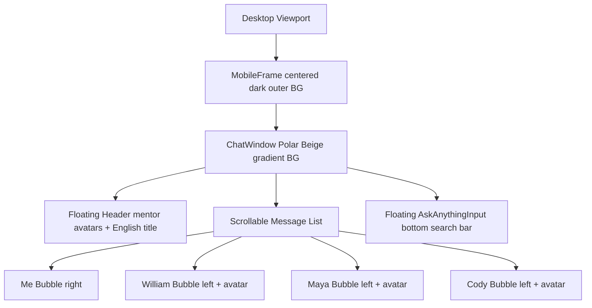

# Triad AI UX Mentor

> A mobile-first conversational UI prototype where three AI UX mentors respond like a live group chat.

Triad AI UX Mentor is a lightweight MVP for an AI-native UX mentoring experience. It is not designed as a generic chatbot. The goal is to make users feel like they are speaking with a small, believable team of UX mentors in real time.

## Core Concept

The product centers on three mentor agents:

- **William** — strategic UX mentor focused on product reasoning, systems thinking, business impact, and portfolio maturity.
- **Maya** — human-centered UX mentor focused on storytelling, emotional clarity, communication quality, and presentation flow.
- **Cody** — UX research and AI workflow mentor focused on usability evidence, research quality, automation, and operational UX.

Users ask questions through a floating **Ask anything** input. Their message appears on the right, and the mentors respond on the left with avatar-supported message bubbles, staged timing, and typing indicators.

## Screen Structure



## Phase 1 Scope

Phase 1 focuses on the prototype experience without a live AI API.

- Mobile chat UI inside a centered phone frame on desktop
- Full Polar Beige gradient background
- Floating top profile/title bar
- Floating bottom input/search bar
- Fake multi-agent orchestration from local mock scenarios
- Cody intro message on page load
- Typing indicators and staged mentor responses
- Message bubbles with Woong Design gradient tokens
- Refresh button for resetting the chat

## Design Direction

The UI follows `Woongdesign.md`:

- **Background**: Polar Beige gradient
- **User / Me bubble**: Mystic Violet → Kinetic Azure
- **William bubble**: Kinetic Azure → Phantom Night
- **Maya bubble**: Terracotta Red → Abyssal Red
- **Cody bubble**: Mystic Violet → Auburn Flare
- **Typography**: Pretendard-based body text
- **Visual language**: typography, color planes, whitespace, rounded surfaces

## Architecture

```text
/app
  layout.tsx
  page.tsx
  globals.css
/components
  MobileFrame.tsx
  ChatWindow.tsx
  ChatHeader.tsx
  MessageBubble.tsx
  AgentAvatar.tsx
  TypingIndicator.tsx
  AskAnythingInput.tsx
/lib
  agents.ts
  fakeOrchestrator.ts
  tokens.ts
  types.ts
/mock
  intro.json
  scenarios.json
/public/agents
  William.png
  Maya.png
  Cody.png
```

## Tech Stack

- **Next.js App Router**
- **React**
- **TypeScript**
- **Tailwind CSS**
- **Framer Motion**

## Running Locally

```bash
npm install
npm run dev
```

Open `http://localhost:3000`.

## MVP Rules

The MVP intentionally avoids:

- Real multi-agent infrastructure
- LangGraph
- Vector database
- Distributed agents
- WebSocket realtime sync
- Advanced orchestration

Instead, the first version uses fake multi-agent orchestration, local mock data, typing delays, and staged rendering to create a believable mentoring experience.

## Roadmap

| Phase | Scope |
|---|---|
| **Phase 1** | Mobile chat UI, fake scenarios, typing animation, intro sequence |
| **Phase 2** | Gemini 2.5 Flash integration and `[William] / [Maya] / [Cody]` response parsing |
| **Phase 3** | Cody proactive news feed |
| **Phase 4** | Portfolio upload, preview, and page selection |
| **Phase 5** | Portfolio AI analysis |
| **Phase 6** | Local memory and chat history optimization |

## Philosophy

The priority is not technical complexity. The priority is the feeling of speaking with a real UX mentor team.

Triad should feel alive, emotionally aware, practical, and strategically useful before it becomes architecturally sophisticated.
